# 跨平台内核事件采集系统概要设计

## 1. 介绍

### 1.1. 目的
本设计旨在构建一个高性能、跨平台的内核级事件采集系统，支持Linux和Windows平台，实现对文件、进程、网络等关键系统事件的实时采集、过滤、分发和上报，为安全产品提供底层数据支撑。

### 1.2. 定义和缩写
- **LSM**: Linux Security Module，Linux安全模块框架
- **WFP**: Windows Filtering Platform，Windows过滤平台
- **RCU**: Read-Copy-Update，读-复制-更新同步机制
- **GC**: Garbage Collection，垃圾回收
- **EventFD**: Linux事件文件描述符
- **MiniFilter**: Windows文件系统过滤驱动框架
- **Kprobe**: Linux内核探测点机制
- **ioctl**: Input/Output Control，设备输入输出控制
- **mmap**: Memory Map，内存映射

### 1.3. 参考和引用
- 需求文档：《跨平台内核事件采集方案需求（最终整理版）》
- Linux内核文档：LSM框架说明
- Windows驱动开发文档：MiniFilter驱动开发指南
- RCU机制原理与实现

## 2. 设计任务书

### 2.1 需求跟踪

| 编号 | 需求点名称 | 需求点说明/验收条件 | 自检 |
| ---- | --------- | ------------------ | ---- |
| 1 | 跨平台支持 | 支持Linux 4.x+和Windows平台，70-75%代码平台无关 | 通过，见4.3、4.5.10 |
| 2 | 事件采集范围 | 采集文件、进程、网络三类事件，支持动态开关 | 通过，见6.1 |
| 3 | 事件过滤机制 | 支持内置白名单、多维度过滤条件、运行时更新 | 通过，见6.2 |
| 4 | 事件分发机制 | 支持多模块订阅、顺序分发、结果汇总 | 通过，见6.3 |
| 5 | 同步上抛机制 | 支持阻断决策、超时控制、顺序执行 | 通过，见6.4 |
| 6 | 异步上抛机制 | 无阻塞写入、共享内存、确认机制 | 通过，见6.4 |
| 7 | 零拷贝机制 | 单份存储、多进程共享、原子确认 | 通过，见6.5 |
| 8 | 可靠性保证 | 垃圾回收、异常处理、并发安全 | 通过，见4.5.8 |
| 9 | 性能指标 | 10万+事件/秒、CPU<5%、内存<64MB | 通过，见6.7 |

### 2.2 模块整体目标

| 编号 | 目标项概述 | 对应的评审标准 | 自检 |
| ---- | --------- | ------------- | ---- |
| 1 | 性能 | 事件处理速度：10万+事件/秒 | 通过 |
| | | 延迟：微秒级事件采集和分发 | 通过 |
| | | CPU占用率：< 5% | 通过 |
| 2 | 资源开销 | 内存占用：< 64MB | 通过 |
| | | 内核缓冲区：8MB-32MB可配置 | 通过 |
| 3 | 可靠性要求 | 进程崩溃不影响其他订阅者 | 通过 |
| | | 缓冲区满时分级处理 | 通过 |
| | | 支持慢读进程检测和处理 | 通过 |
| 4 | 兼容性 | Linux内核：4.x及以上 | 通过 |
| | | Windows：Win10及以上 | 通过 |
| 5 | 可扩展性 | 支持新增事件类型 | 通过 |
| | | 支持动态加载业务模块 | 通过 |

### 2.3 流程要求

| 该文档是否需要外部评审？ | 是 | 按设计流程要求 |
| ----------------------- | -- | ------------- |
| **审核人签名** | **待定** | **时间：** |

## 3. 对外接口

### 3.1 API接口

| 名称 | kec_register_subscriber | - | - | - |
| ---- | ---------------------- | - | - | - |
| **功能** | **注册事件订阅者** | - | - | - |
| | 参数名 | 类型 | 方向 | 说明 |
| | event_mask | uint32_t | in | 事件类型掩码 |
| | callback | kec_callback_t | in | 事件回调函数 |
| | sync_mode | bool | in | 是否同步模式 |
| | timeout_ms | uint32_t | in | 超时时间(毫秒) |
| **参数** | - | - | - | - |
| **返回值** | 订阅句柄(成功)或错误码(失败) | - | - | - |

| 名称 | kec_set_filter | - | - | - |
| ---- | ------------- | - | - | - |
| **功能** | **设置事件过滤规则** | - | - | - |
| | 参数名 | 类型 | 方向 | 说明 |
| | filter_type | uint32_t | in | 过滤类型 |
| | filter_rule | kec_filter_t* | in | 过滤规则结构 |
| **参数** | - | - | - | - |
| **返回值** | 0(成功)或错误码(失败) | - | - | - |

| 名称 | kec_get_event | - | - | - |
| ---- | ------------ | - | - | - |
| **功能** | **获取事件数据** | - | - | - |
| | 参数名 | 类型 | 方向 | 说明 |
| | handle | int | in | 订阅句柄 |
| | event_buf | void* | out | 事件缓冲区 |
| | buf_size | size_t | in | 缓冲区大小 |
| **参数** | - | - | - | - |
| **返回值** | 事件大小(成功)或错误码(失败) | - | - | - |

### 3.2. 消息接口

| 名称 | kec_event_header | - |
| ---- | --------------- | - |
| **说明** | **事件通用头部，所有事件的公共部分** | - |
| **字段名** | **类型/长度(单位bit)** | 说明 |
| event_type | 32 | 事件类型 |
| timestamp | 64 | 事件时间戳 |
| process_id | 32 | 进程ID |
| thread_id | 32 | 线程ID |
| event_size | 32 | 事件总大小 |
| ack_bitmap | 64 | 确认位图 |
| seq_num | 64 | 序列号 |

## 4. 概要说明

### 4.1. 背景描述

#### 4.1.1. 工作原理
系统采用内核驱动方式实现，通过在操作系统内核层挂钩关键系统调用和事件回调，实现对系统事件的实时采集。采集到的事件经过初步过滤后，通过共享内存机制传递给用户态程序，支持同步和异步两种处理模式。

核心工作流程：
1. 内核事件触发 → 事件采集器捕获
2. 初步过滤（白名单、规则匹配）
3. 分发给订阅的内核模块
4. 上报给用户态（同步/异步）
5. 用户态处理并返回决策（同步模式）

#### 4.1.2. 应用场景
- **安全监控场景**：实时监控系统中的文件访问、进程创建、网络连接等行为，及时发现异常
- **审计合规场景**：记录关键操作行为，满足合规审计要求
- **威胁检测场景**：通过行为分析识别潜在威胁，支持主动防御
- **性能分析场景**：采集系统性能相关事件，用于性能优化

#### 4.1.3. 对手分析
- **CrowdStrike Falcon**：采用内核驱动+云端分析架构，优点是检测能力强，缺点是依赖云端
- **Microsoft Sysmon**：基于ETW框架，优点是与Windows集成好，缺点是仅支持Windows
- **osquery**：Facebook开源方案，优点是跨平台SQL查询，缺点是用户态实现性能有限

借鉴点：
- CrowdStrike的轻量级内核驱动设计
- Sysmon的事件聚合机制
- osquery的跨平台抽象层设计

### 4.2 方案选型

| 评估准则 | 权重 | 评估方法 | 方案1：全内核态 | 方案2：内核+用户态混合 | 方案3：全用户态 |
| ------- | ---- | ------- | -------------- | ------------------- | -------------- |
| 性能开销 | 40% | 基准测试 | 95分 | 85分 | 60分 |
| 实现复杂度 | 20% | 工作量评估 | 50分 | 80分 | 90分 |
| 可维护性 | 20% | 代码复杂度 | 60分 | 85分 | 95分 |
| 安全性 | 20% | 威胁分析 | 90分 | 85分 | 70分 |

| 备选方案名称 | 本方案的优点 | 本方案的风险和缺点 | 最终选择 |
| ----------- | ----------- | ----------------- | ------- |
| 方案1：全内核态 | 性能最优、延迟最低 | 开发维护困难、容易引起系统崩溃 | |
| 方案2：内核+用户态混合 | 平衡性能和复杂度、模块化好 | 需要处理内核用户态通信 | ✓ |
| 方案3：全用户态 | 开发简单、稳定性好 | 性能差、无法实现阻断 | |

### 4.3 静态结构

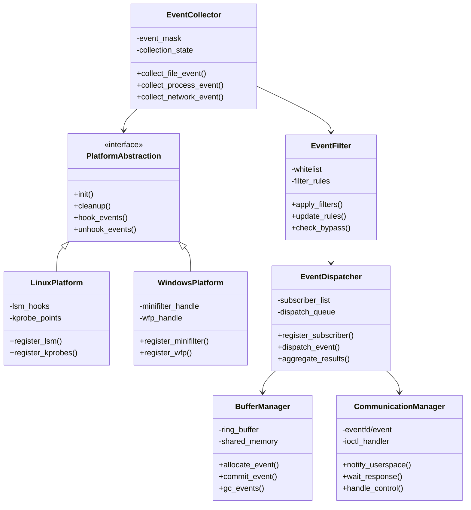

### 4.4. 对软件总体架构的影响

| 情况分类 | 是否对总设有影响 |
| ------- | -------------- |
| 1.本次新增或调整的模块对总体架构是否有影响 | 是 |
| 2.本次新增或调整的模块对总体架构有一定程度的影响，但涉及的模块少于3个 | 否 |
| 3.本次新增或调整的模块对总体架构有较大影响，需要对原有软件架构进行较大调整或者重新设计 | 否 |

影响说明：本系统作为底层内核模块，将为上层安全产品提供统一的事件采集能力，需要定义标准的事件格式和接口规范。

### 4.5. 概要流程

#### 4.5.1. 事件采集流程

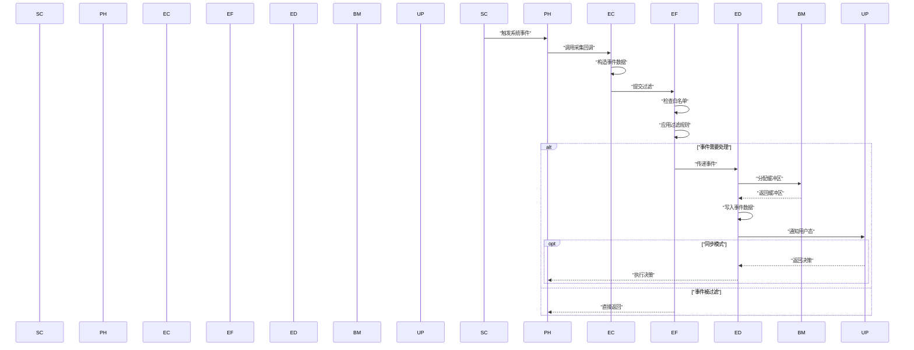

#### 4.5.2. 多订阅者分发流程

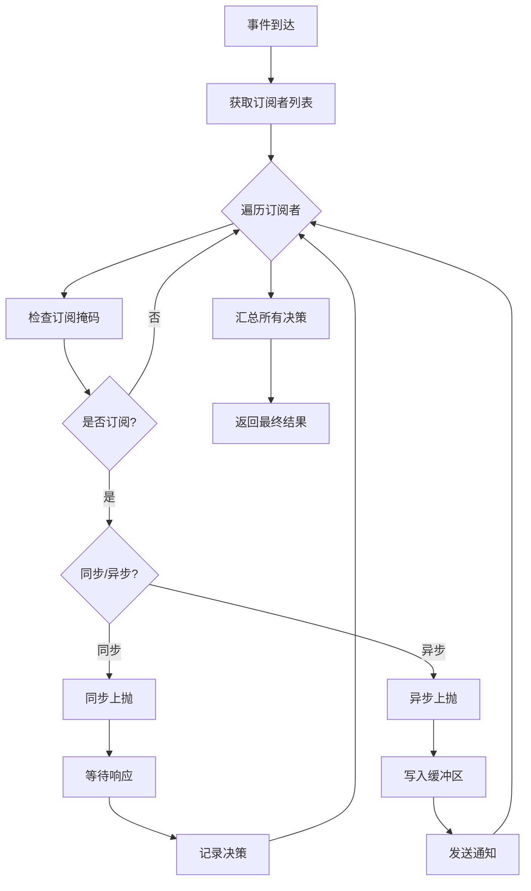

#### 4.5.3. 可调试性机制分析及设计

调试难点：
- 内核态调试困难，无法使用常规调试器
- 高并发场景难以复现
- 事件量大时难以追踪特定事件

调试机制设计：
1. **调试日志系统**：分级日志输出，支持运行时动态调整日志级别
2. **事件追踪机制**：为每个事件分配唯一ID，记录处理路径
3. **统计计数器**：记录各类事件数量、过滤数量、丢弃数量等
4. **调试接口**：提供ioctl接口查询内部状态、统计信息
5. **事件录制回放**：支持将事件序列保存，用于问题复现

#### 4.5.4. 可测试性机制分析及设计

测试难点：
- 内核模块测试需要特殊环境
- 并发和性能测试复杂
- 跨平台测试工作量大

测试机制设计：
1. **模拟事件注入**：提供测试接口，可注入模拟事件
2. **单元测试框架**：核心逻辑抽离为独立函数，支持单元测试
3. **性能基准测试**：内置性能测试模式，自动生成测试报告
4. **自动化测试接口**：支持通过脚本批量测试各种场景

#### 4.5.5. 可扩展可复用设计

扩展点设计：
1. **事件类型扩展**：采用注册机制，支持动态添加新事件类型
2. **过滤规则扩展**：规则引擎设计，支持自定义过滤逻辑
3. **平台扩展**：抽象平台接口，便于支持新平台
4. **业务模块扩展**：插件式架构，支持动态加载业务模块

#### 4.5.6. 系统隐私设计

隐私保护措施：
1. 事件数据最小化采集，仅采集必要字段
2. 敏感数据脱敏处理（如用户密码、私钥等）
3. 访问控制机制，仅授权进程可订阅事件
4. 事件数据不持久化存储在内核

#### 4.5.7. 安全性设计

##### 4.5.7.1 威胁建模分析

| 威胁类型 | 威胁描述 | 影响 | 缓解措施 |
| ------- | ------- | ---- | ------- |
| 权限提升 | 恶意程序利用驱动漏洞提权 | 高 | 输入验证、最小权限原则 |
| 拒绝服务 | 大量事件导致系统资源耗尽 | 中 | 流量控制、资源限制 |
| 信息泄露 | 敏感信息通过事件泄露 | 中 | 数据脱敏、访问控制 |
| 绕过检测 | 攻击者绕过事件采集 | 高 | 多层次采集、完整性校验 |

##### 4.5.7.2 安全设计

1. **访问控制**：仅允许特权进程加载驱动和订阅事件
2. **输入验证**：严格验证所有用户态输入
3. **资源限制**：限制每个订阅者的资源使用
4. **完整性保护**：驱动签名验证，防止篡改

#### 4.5.8. 可靠性设计

**1、承载载体可靠**

1.1）服务故障自动恢复：
- 内核模块异常检测和自动重载机制
- 关键数据结构完整性校验
- 事件处理超时自动跳过

1.2）数据可靠性：
- 环形缓冲区防止数据丢失
- 双缓冲设计支持热升级预留
- 垃圾回收确保资源释放

**2、周边无影响**

资源隔离机制：
- CPU使用率限制在5%以内
- 内存使用上限64MB
- 事件处理采用异步机制，不阻塞系统调用
- Per-CPU缓冲区避免锁竞争

**3、业务流程可靠**

FMEA分析：

| 功能 | 失效模式 | 失效原因 | 严重度 | 发生度 | 检测度 | 改进措施 |
| ---- | ------- | ------- | ------ | ------ | ------ | ------- |
| 事件采集 | 事件丢失 | 缓冲区满 | 高 | 中 | 易 | 动态扩容、分级丢弃 |
| 事件过滤 | 误过滤 | 规则错误 | 中 | 低 | 难 | 规则验证、测试覆盖 |
| 同步上抛 | 超时阻塞 | 用户态无响应 | 高 | 中 | 易 | 超时机制、异常处理 |
| 垃圾回收 | 内存泄露 | GC失效 | 高 | 低 | 中 | 定期强制回收 |

#### 4.5.9. 可维护设计

维护支持机制：
1. **诊断接口**：提供/proc或/sys接口查看运行状态
2. **日志系统**：分级日志，支持动态调整
3. **版本信息**：记录驱动版本、编译信息
4. **健康检查**：定期自检，上报健康状态

#### 4.5.10. 跨平台设计和平台差异处理

平台抽象层设计：
- 70-75%代码为平台无关的核心逻辑
- 25-30%代码为平台相关的适配层
- 使用函数指针表隔离平台差异
- CMAKE统一构建系统

平台差异处理：

| 功能 | Linux实现 | Windows实现 |
| ---- | --------- | ----------- |
| 文件事件 | LSM hooks | MiniFilter |
| 进程事件 | LSM + Kprobe | 进程回调 |
| 网络事件 | Netfilter | WFP |
| 共享内存 | mmap | MapViewOfFile |
| 事件通知 | eventfd | Event对象 |
| 控制接口 | ioctl | DeviceIoControl |

### 4.6. 方案风险分析

| 风险点 | 风险预研结果/风险规避措施 |
| ----- | ----------------------- |
| 性能未达10万事件/秒 | 采用无锁设计、Per-CPU缓冲、批量处理优化 |
| 内存使用超过64MB | 动态调整缓冲区大小、及时回收、限制订阅者数量 |
| 跨平台代码复用率低于70% | 细化抽象层设计、最小化平台相关代码 |
| 驱动签名问题 | 提前申请证书、使用测试签名开发 |
| 内核版本兼容性 | 条件编译处理版本差异、运行时检测 |

## 5. 数据结构设计

### 5.1. 配置文件定义

配置文件路径：
- Linux: /etc/kec/kec.conf
- Windows: C:\ProgramData\KEC\kec.conf

| 名称 | 作用 | 默认值 | 取值范围 |
| ---- | ---- | ------ | -------- |
| buffer_size | 环形缓冲区大小 | 16777216 | [8388608, 33554432] |
| max_subscribers | 最大订阅者数量 | 32 | [1, 128] |
| event_timeout_ms | 同步事件超时时间 | 100 | [10, 1000] |
| gc_interval_ms | 垃圾回收间隔 | 1000 | [100, 10000] |
| log_level | 日志级别 | 2 | [0-5] |
| bypass_file_events | 文件事件旁路开关 | 0 | [0, 1] |
| bypass_process_events | 进程事件旁路开关 | 0 | [0, 1] |
| bypass_network_events | 网络事件旁路开关 | 0 | [0, 1] |

### 5.2. 全局数据结构定义

| 结构说明 | 事件基础结构，所有事件的公共部分 | - | - |
| ------- | -------------------------------- | - | - |
| **结构定义** | **struct kec_event_base** | - | - |
| **字段说明** | **字段名** | **取值范围** | **说明** |
| - | event_type | [0, 0xFFFFFFFF] | 事件类型标识 |
| - | timestamp | 64位时间戳 | 事件发生时间 |
| - | process_id | [0, 0xFFFFFFFF] | 进程ID |
| - | thread_id | [0, 0xFFFFFFFF] | 线程ID |
| - | event_size | [0, 8192] | 事件总大小 |
| - | ack_bitmap | 64位位图 | 确认位图 |
| - | seq_num | 64位序列号 | 事件序列号 |
| - | data[0] | 可变长度 | 事件特定数据 |

| 结构说明 | 过滤规则结构 | - | - |
| ------- | ----------- | - | - |
| **结构定义** | **struct kec_filter_rule** | - | - |
| **字段说明** | **字段名** | **取值范围** | **说明** |
| - | rule_type | [0, 31] | 规则类型 |
| - | match_type | [0, 7] | 匹配类型 |
| - | priority | [0, 255] | 优先级 |
| - | pattern_len | [0, 1024] | 模式长度 |
| - | pattern[0] | 可变长度 | 匹配模式 |

## 6. 流程设计

### 6.1. 事件采集模块

#### 6.1.1. 静态结构

事件采集模块负责从操作系统内核获取原始事件，是整个系统的数据源。该模块通过平台抽象层与具体平台交互，确保跨平台兼容性。

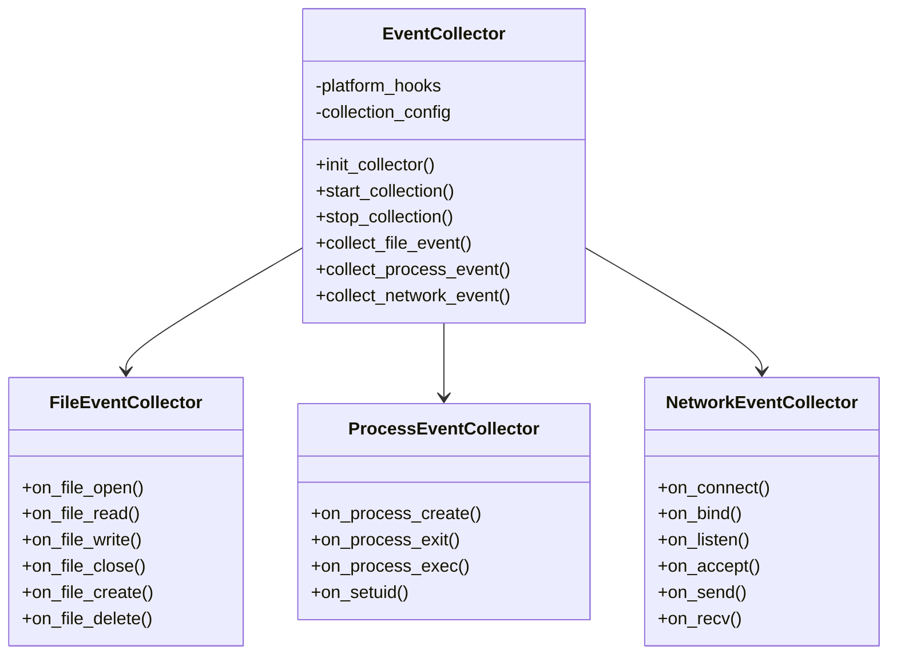

#### 6.1.2. 处理流程

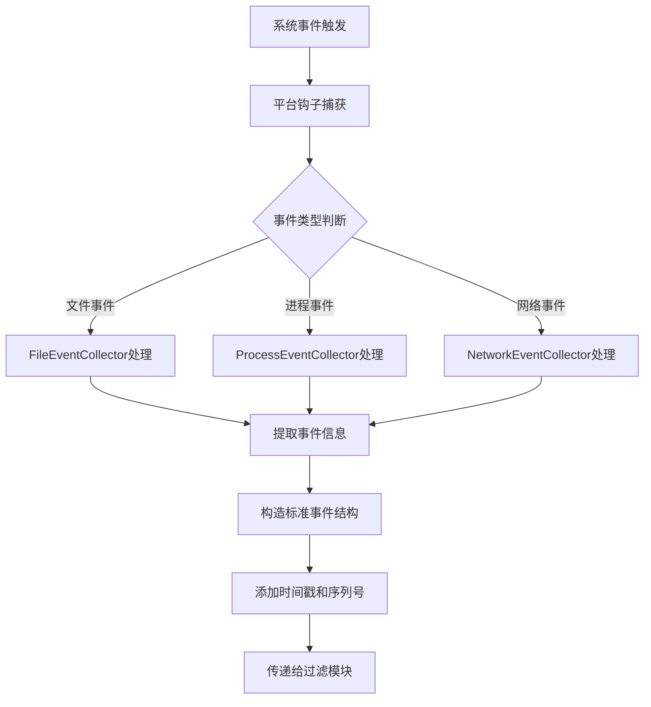

#### 6.1.3. 关键算法描述

**高性能事件采集算法**：
- 采用Per-CPU缓冲区，避免多核竞争
- 使用RCU机制保护读路径，无锁设计
- 批量处理机制，减少上下文切换

性能指标：
- 常见场景：单个事件处理 < 1微秒
- 最差场景：高并发10万事件/秒时，延迟 < 10微秒

#### 6.1.4. 数据结构定义

```c
struct file_event {
    struct kec_event_base base;
    uint32_t operation;    // open/read/write/close等
    uint64_t file_size;
    char file_path[256];
    char process_name[64];
};

struct process_event {
    struct kec_event_base base;
    uint32_t operation;    // create/exit/exec等
    uint32_t parent_pid;
    char process_path[256];
    char cmdline[512];
};

struct network_event {
    struct kec_event_base base;
    uint32_t operation;    // connect/bind/send/recv等
    uint32_t local_ip;
    uint32_t remote_ip;
    uint16_t local_port;
    uint16_t remote_port;
    uint8_t protocol;
};
```

#### 6.1.5. 函数列表

| 函数名 | 函数功能 | 参数及返回值 | 说明 |
| ------ | ------- | ------------ | ---- |
| init_collector | 初始化采集器 | 返回：0成功，<0失败 | 注册平台钩子 |
| collect_file_event | 采集文件事件 | [in]operation: 操作类型<br>[in]file: 文件信息<br>返回：事件指针 | 构造文件事件 |
| collect_process_event | 采集进程事件 | [in]operation: 操作类型<br>[in]task: 进程信息<br>返回：事件指针 | 构造进程事件 |
| collect_network_event | 采集网络事件 | [in]operation: 操作类型<br>[in]sk: socket信息<br>返回：事件指针 | 构造网络事件 |

#### 6.1.6. 设计要点检视

| 可维护/可调试措施 | 每个事件分配唯一ID，记录处理路径；分级日志系统；性能统计计数器 |
| ---------------- | --------------------------------------------------------- |
| **可测试性** | 提供模拟事件注入接口；支持单元测试；自动化测试框架 |
| **自动化测试支持** | 批量测试脚本；性能基准测试；回归测试套件 |
| **可扩展性** | 事件类型可动态注册；采集钩子可配置；支持新平台扩展 |
| **稳定性保证措施** | 异常捕获和恢复；资源限制；降级机制 |
| **工作量估算** | 20人天 |

### 6.2. 事件过滤模块

#### 6.2.1. 静态结构

事件过滤模块负责对采集到的事件进行初步筛选，减少无效事件的传递，提高系统效率。

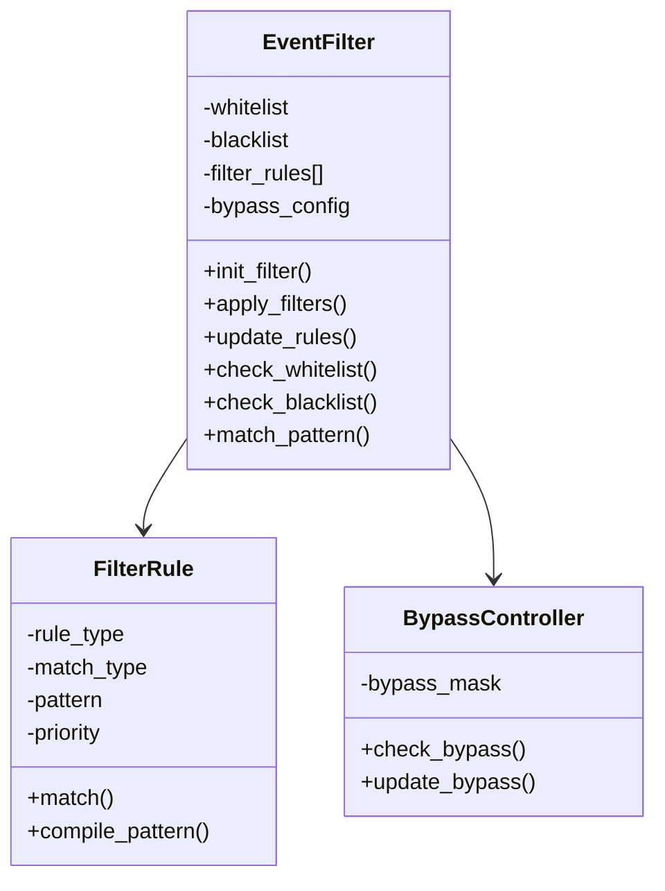

#### 6.2.2. 处理流程

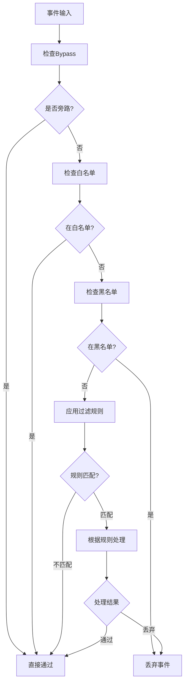

#### 6.2.3. 关键算法描述

**高效模式匹配算法**：
- 使用Aho-Corasick算法进行多模式匹配
- 路径匹配采用前缀树优化
- 规则预编译，提高匹配速度

性能指标：
- 单规则匹配：< 100纳秒
- 100条规则匹配：< 1微秒

#### 6.2.4. 函数列表

| 函数名 | 函数功能 | 参数及返回值 | 说明 |
| ------ | ------- | ------------ | ---- |
| apply_filters | 应用所有过滤规则 | [in]event: 事件指针<br>返回：0通过，1丢弃 | 主过滤函数 |
| update_rules | 更新过滤规则 | [in]rules: 规则数组<br>[in]count: 规则数量<br>返回：0成功 | 动态更新 |
| check_whitelist | 检查白名单 | [in]event: 事件指针<br>返回：bool | 白名单匹配 |
| match_pattern | 模式匹配 | [in]data: 数据<br>[in]pattern: 模式<br>返回：bool | 通用匹配 |

### 6.3. 事件分发模块

#### 6.3.1. 静态结构

事件分发模块负责将过滤后的事件分发给各个订阅者，支持多订阅者同时处理。

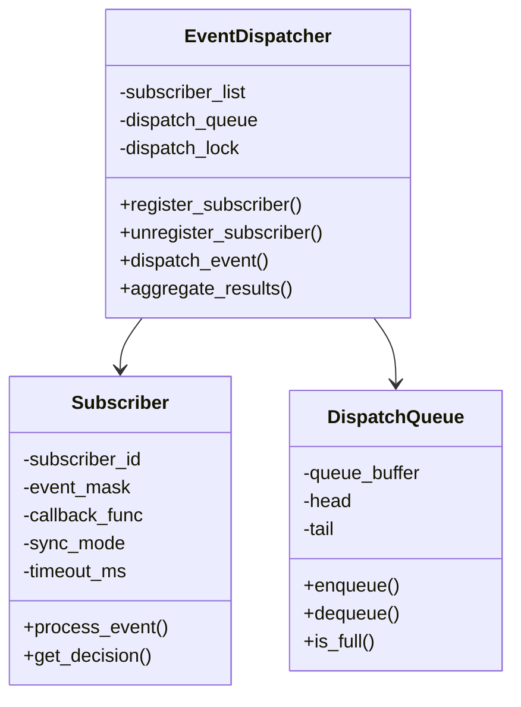

#### 6.3.2. 处理流程

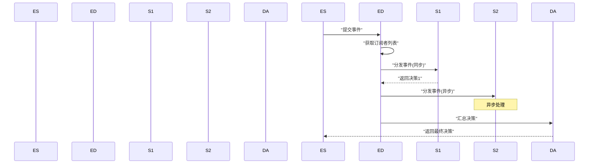

#### 6.3.3. 函数列表

| 函数名 | 函数功能 | 参数及返回值 | 说明 |
| ------ | ------- | ------------ | ---- |
| register_subscriber | 注册订阅者 | [in]config: 订阅配置<br>返回：订阅句柄 | 动态注册 |
| dispatch_event | 分发事件 | [in]event: 事件指针<br>返回：分发结果 | 核心分发 |
| aggregate_results | 汇总决策 | [in]decisions: 决策数组<br>返回：最终决策 | 决策合并 |

### 6.4. 上报机制模块

#### 6.4.1. 静态结构

上报机制模块负责将事件数据传递给用户态程序，支持同步和异步两种模式。

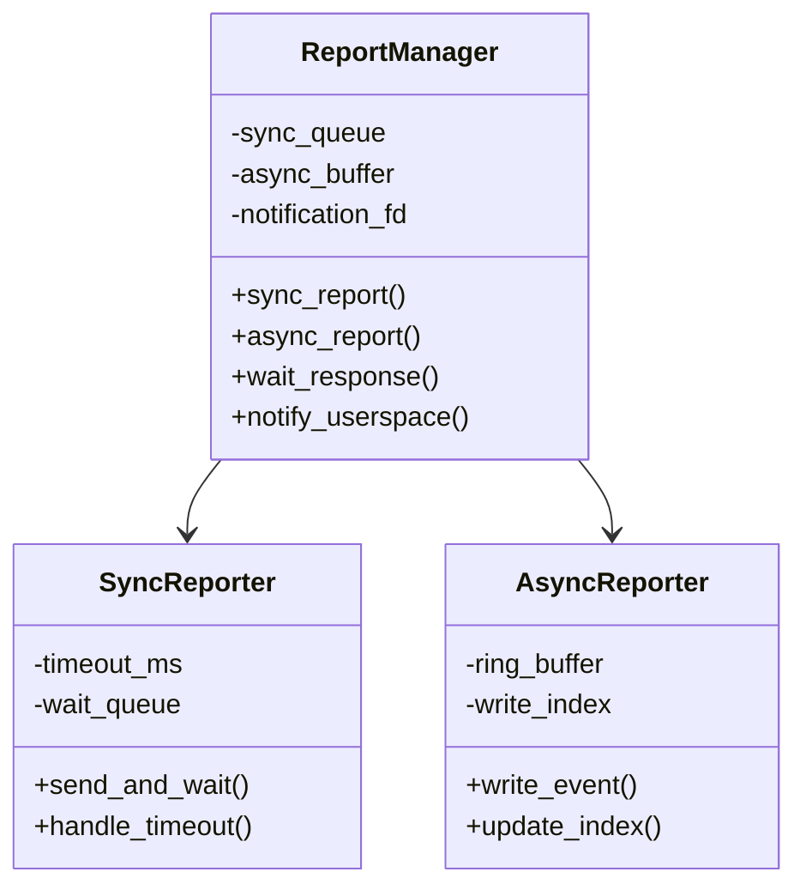

#### 6.4.2. 处理流程

**同步上报流程**：
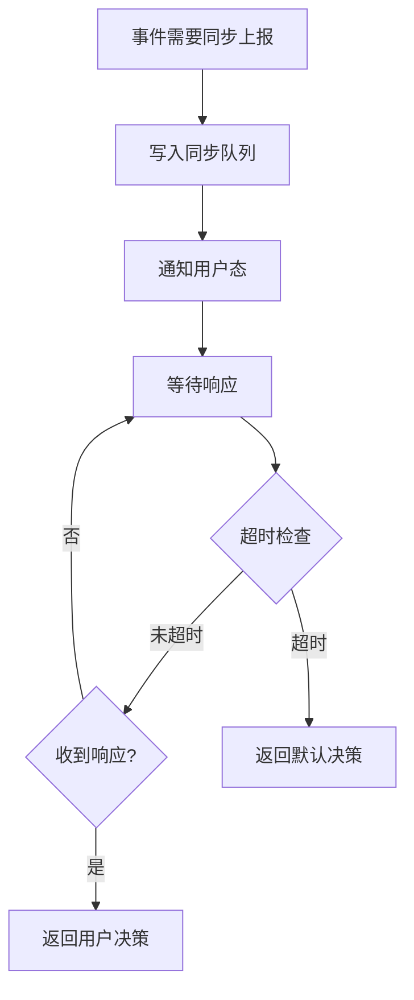

**异步上报流程**：
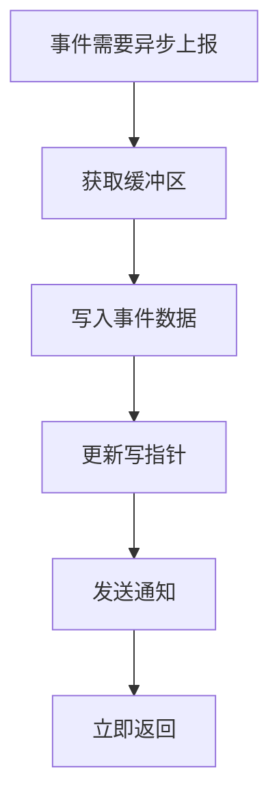

### 6.5. 缓冲管理模块

#### 6.5.1. 静态结构

缓冲管理模块负责管理共享内存缓冲区，实现零拷贝数据传输。

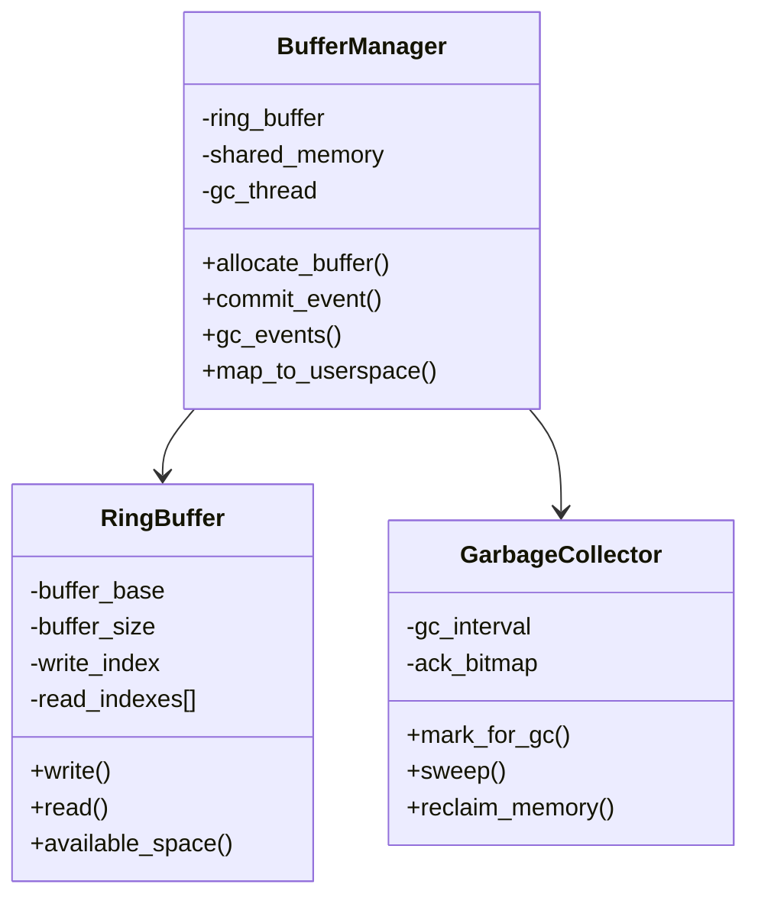

#### 6.5.2. 处理流程

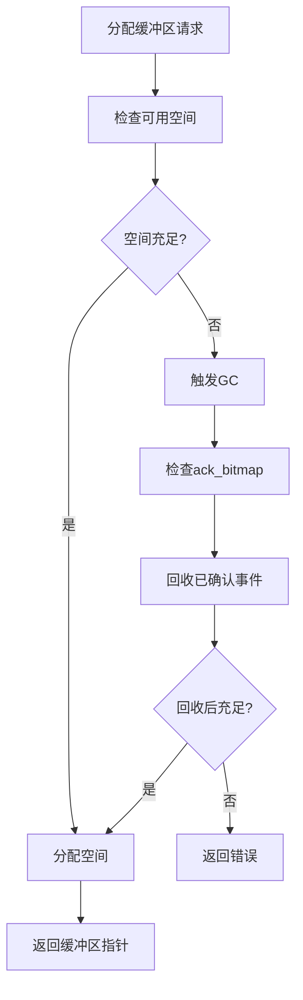

#### 6.5.3. 垃圾回收算法

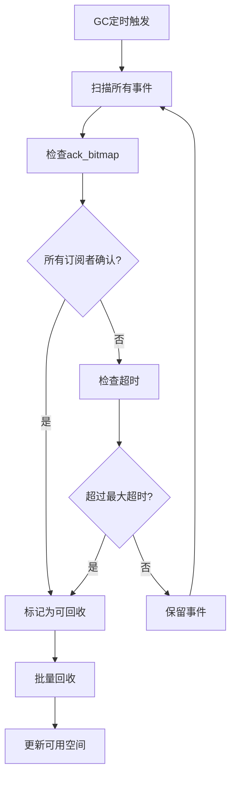

### 6.6. 通信管理模块

#### 6.6.1. 静态结构

通信管理模块负责内核态与用户态之间的通信。

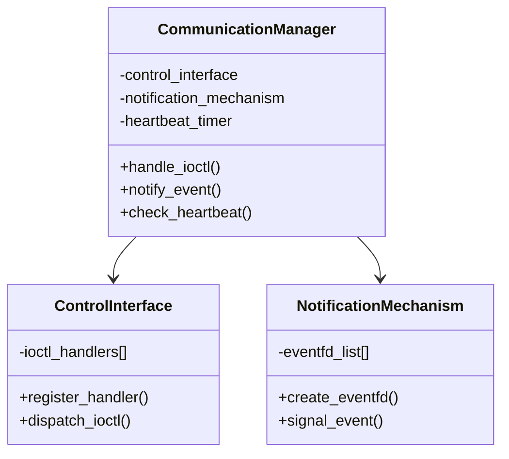

#### 6.6.2. 处理流程

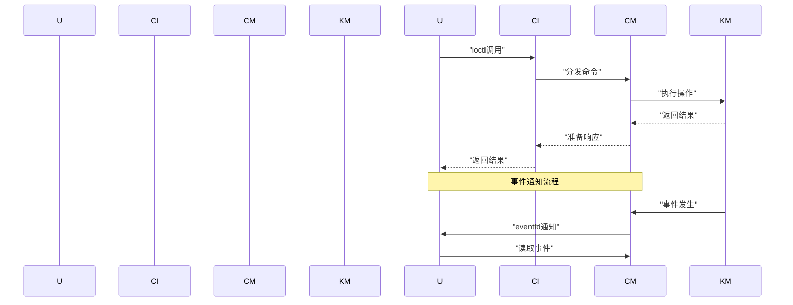

### 6.7. 性能优化模块

#### 6.7.1. 静态结构

性能优化模块提供各种优化机制，确保系统达到性能指标。

#### 6.7.2. 优化策略

1. **无锁设计**：
   - Per-CPU缓冲区
   - RCU保护读路径
   - 原子操作更新计数器

2. **批量处理**：
   - 事件批量写入
   - 批量通知机制
   - 延迟合并相似事件

3. **缓存优化**：
   - CPU缓存行对齐
   - 热点数据分离
   - NUMA感知内存分配

4. **动态调优**：
   - 自适应缓冲区大小
   - 动态调整GC频率
   - 负载均衡分发

## 7. 完成设计checklist自检

设计自检项：

| 检查项 | 状态 | 说明 |
| ------ | ---- | ---- |
| 需求覆盖完整性 | ✓ | 所有需求点已覆盖 |
| 接口定义清晰 | ✓ | API接口和消息格式已定义 |
| 跨平台设计 | ✓ | 70%+代码平台无关 |
| 性能指标可达 | ✓ | 设计满足10万事件/秒 |
| 可靠性机制 | ✓ | FMEA分析完成 |
| 安全性考虑 | ✓ | 威胁建模和缓解措施 |
| 可测试性 | ✓ | 测试接口和机制设计 |
| 可维护性 | ✓ | 调试和诊断机制完备 |

## 8. 总结

### 8.1. 关联分析

本系统作为底层内核模块，将影响：
- 上层安全产品的事件获取方式
- 系统整体性能
- 跨平台部署策略

需要与以下模块负责人沟通：
- 安全引擎模块
- 规则引擎模块
- 日志存储模块

### 8.2. 遗留问题解决

| 问题 | 解决方案 | 计划 |
| ---- | ------- | ---- |
| 热升级支持 | 双缓冲设计预留 | 下版本实现 |
| MacOS平台支持 | 预留平台抽象接口 | 后续版本 |
| 容器环境支持 | namespace感知 | 下版本增强 |

## 9. 业务逻辑相关的测试用例

### 9.1 功能测试用例

1. **事件采集测试**
   - 测试步骤：创建文件、修改文件、删除文件
   - 验证点：检查是否生成对应事件，事件字段是否正确

2. **过滤规则测试**
   - 测试步骤：配置白名单、黑名单、过滤规则
   - 验证点：验证事件是否按规则过滤

3. **同步上报测试**
   - 测试步骤：订阅同步事件，触发事件，返回决策
   - 验证点：验证阻断决策是否生效

4. **异步上报测试**
   - 测试步骤：订阅异步事件，批量触发事件
   - 验证点：验证事件是否全部接收，无丢失

### 9.2 性能测试用例

1. **吞吐量测试**
   - 测试步骤：并发触发10万事件/秒
   - 验证点：CPU占用<5%，无事件丢失

2. **延迟测试**
   - 测试步骤：测量单个事件处理时间
   - 验证点：平均延迟<1微秒

### 9.3 可靠性测试用例

1. **异常恢复测试**
   - 测试步骤：模拟订阅者崩溃
   - 验证点：其他订阅者正常工作

2. **资源耗尽测试**
   - 测试步骤：触发大量事件填满缓冲区
   - 验证点：垃圾回收正常，系统不崩溃

## 10. 变更控制

### 10.1. 变更列表

| 变更章节 | 变更内容 | 变更原因 | 变更影响 |
| ------- | ------- | ------- | ------- |
| 待定 | 待定 | 待定 | 待定 |