# 跨平台内核事件采集系统设计文档

## 1. 项目概述

### 1.1 项目背景与定位
- **目标定位**：构建高性能、跨平台的内核级事件采集系统
- **支持平台**：Linux（4.x+）、Windows（Win7+）
- **实现方式**：内核驱动/内核扩展
- **架构原则**：
  - 平台无关核心（70-75%代码）
  - 平台相关适配层（25-30%代码）
  - 接口与协议向前兼容

### 1.2 性能指标要求
| 指标类型 | 目标值 | 说明 |
|---------|--------|------|
| 延迟 | < 10μs | 事件采集到分发的延迟 |
| 吞吐量 | > 100,000 events/s | 峰值处理能力 |
| CPU占用 | < 5% | 正常负载下的CPU使用率 |
| 内存占用 | < 64MB | 内核态总内存占用 |
| 数据传输 | 零拷贝 | 共享内存避免数据复制 |

## 2. 系统架构设计

### 2.1 总体架构图


### 2.2 分层设计

| 层级 | 功能职责 | 主要组件 |
|------|---------|---------|
| 平台适配层 | 屏蔽平台差异，提供统一接口 | LSM/Kprobe、MiniFilter/WFP |
| 事件处理层 | 事件过滤、路由、分发 | 过滤器、路由器、分发器 |
| 业务模块层 | 事件加工、策略判定 | 各业务模块 |
| 缓冲管理层 | 内存管理、数据存储 | 缓冲区管理器、GC |
| 通信层 | 内核用户态通信 | 共享内存、事件通知、控制接口 |

## 3. 核心功能模块设计

### 3.1 事件采集模块

#### 3.1.1 采集事件类型


#### 3.1.2 平台采集策略

**Linux平台**：
- 主数据源：LSM（Linux Security Module）
  - 覆盖90%以上安全相关事件
  - 原生支持阻断操作
  - API稳定，性能开销低
- 辅助数据源：Kprobe
  - 仅用于LSM未覆盖事件（如fork）
  - 动态插桩，灵活性高

**Windows平台**：
- MiniFilter：文件系统过滤
- 进程/线程创建回调
- WFP（Windows Filtering Platform）：网络过滤
- 注册表/对象回调

### 3.2 事件过滤模块

#### 3.2.1 过滤器架构


#### 3.2.2 过滤条件设计

| 过滤类型 | 支持条件 | 匹配方式 |
|---------|---------|---------|
| 进程过滤 | 进程名称、路径前缀 | 精确/前缀匹配 |
| 文件过滤 | 后缀、路径、操作进程 | 通配符匹配 |
| 网络过滤 | 端口、IP段、协议 | 范围/掩码匹配 |

### 3.3 事件分发模块

#### 3.3.1 分发流程


#### 3.3.2 上抛机制设计

**注册机制**：
- 支持多进程订阅同一事件
- 区分同步/异步上抛需求
- 同步上抛需指定超时时间

**同步上抛**：
- 阻塞等待用户态决策
- 超时自动放行
- Linux: ioctl实现
- Windows: DeviceIoControl实现

**异步上抛**：
- 写入缓冲区后立即返回
- 通过EventFD/Event通知
- 支持批量处理

### 3.4 缓冲区管理模块

#### 3.4.1 缓冲区结构设计


#### 3.4.2 内存管理策略


**关键特性**：
- 单份存储，多进程共享（零拷贝）
- 进度信息内嵌事件中
- 原子操作确认，无需系统调用
- 支持版本兼容
- 预留双缓冲设计

### 3.5 垃圾回收模块

#### 3.5.1 回收策略


#### 3.5.2 回收触发条件

| 触发条件 | 阈值 | 处理策略 |
|---------|------|---------|
| 软限制 | 70% | 加速回收 |
| 硬限制 | 90% | 强制回收 |
| 紧急限制 | 95% | 丢弃新事件 |

## 4. 平台抽象设计

### 4.1 抽象接口层

```c
// 平台无关接口定义
typedef struct {
    // 事件采集
    int (*init_hooks)(void);
    void (*cleanup_hooks)(void);
    
    // 内存管理
    void* (*alloc_memory)(size_t size);
    void (*free_memory)(void* ptr);
    
    // 同步机制
    void (*lock_acquire)(void* lock);
    void (*lock_release)(void* lock);
    
    // 通信接口
    int (*create_channel)(void);
    int (*send_event)(void* event);
} platform_ops_t;
```

### 4.2 条件编译最小化


## 5. 可靠性设计

### 5.1 异常处理机制


### 5.2 并发安全设计

| 场景 | 保护机制 | 实现方式 |
|------|---------|---------|
| 多生产者 | Per-CPU缓冲 | 减少锁竞争 |
| 多消费者 | RCU | 读路径无锁 |
| 原子操作 | CAS | 无锁更新 |
| 内存屏障 | Barrier | 保证顺序性 |

### 5.3 心跳机制


## 6. 流程设计

### 6.1 系统初始化流程


### 6.2 事件处理流程

```mermaid
graph TD
    EVENT["事件触发"] --> COLLECT["采集事件"]
    COLLECT --> FILTER["过滤检查"]
    FILTER --> |"丢弃"| END1["结束"]
    FILTER --> |"通过"| ROUTE["路由分发"]
    ROUTE --> PROCESS["业务处理"]
    PROCESS --> |"需上抛"| BUFFER["写缓冲区"]
    PROCESS --> |"不上抛"| END2["结束"]
    BUFFER --> NOTIFY["通知用户态"]
    NOTIFY --> |"同步"| WAIT["等待响应"]
    NOTIFY --> |"异步"| END3["结束"]
    WAIT --> |"超时"| DEFAULT["默认处理"]
    WAIT --> |"响应"| APPLY["应用决策"]
    DEFAULT --> END4["结束"]
    APPLY --> END5["结束"]
```



### 6.3 缓冲区读取流程


### 6.4 垃圾回收流程


## 7. 部署与配置

### 7.1 Linux部署要求

```yaml
kernel:
  version: ">= 4.0"
  config:
    - CONFIG_SECURITY=y
    - CONFIG_SECURITY_SELINUX=y
    - CONFIG_KPROBES=y
    
loading:
  method: "module"  # module 或 built-in
  path: "/lib/modules/$(uname -r)/extra/"
  
permissions:
  - CAP_SYS_MODULE
  - CAP_SYS_ADMIN
```

### 7.2 Windows部署要求

```yaml
system:
  version: ">= Windows 7"
  arch: ["x64", "x86"]
  
driver:
  signing: "required"  # EV证书签名
  type: "kernel"
  framework: "WDF"
  
installation:
  method: "inf"
  service: "boot-start"
```

## 8. 接口定义

### 8.1 用户态API

```c
// 初始化接口
int kec_init(kec_config_t* config);

// 事件订阅
int kec_subscribe(event_type_t type, callback_t cb, int flags);

// 事件读取
int kec_read_events(event_t* buffer, size_t count, int timeout);

// 响应决策
int kec_respond(event_id_t id, decision_t decision);

// 配置更新
int kec_update_config(config_type_t type, void* config);

// 清理接口
void kec_cleanup(void);
```

### 8.2 内核态接口

```c
// 事件注册
int register_event_handler(event_type_t type, handler_t handler);

// 事件发送
int emit_event(event_t* event);

// 缓冲区操作
void* alloc_event_buffer(size_t size);
void free_event_buffer(void* buffer);

// 同步原语
void event_lock(lock_t* lock);
void event_unlock(lock_t* lock);
```

## 9. 数据结构定义

### 9.1 核心数据结构

```c
// 事件头结构
typedef struct {
    uint32_t magic;          // 魔数标识
    uint32_t version;        // 版本号
    uint64_t timestamp;      // 时间戳
    uint32_t event_type;     // 事件类型
    uint32_t event_size;     // 事件大小
    uint32_t process_id;     // 进程ID
    uint32_t thread_id;      // 线程ID
    uint64_t sequence;       // 序列号
    uint32_t ack_bitmap;     // 确认位图
    uint32_t reserved;       // 保留字段
} event_header_t;

// 文件事件结构
typedef struct {
    event_header_t header;
    uint32_t operation;      // 操作类型
    uint32_t flags;          // 操作标志
    uint64_t file_id;        // 文件ID
    char path[PATH_MAX];     // 文件路径
} file_event_t;

// 缓冲区管理结构
typedef struct {
    void* base_addr;         // 基地址
    size_t total_size;       // 总大小
    atomic_t write_pos;      // 写位置
    atomic_t read_pos;       // 读位置
    atomic_t ref_count;      // 引用计数
    spinlock_t lock;         // 自旋锁
} ring_buffer_t;
```

## 10. 测试方案

### 10.1 功能测试

| 测试项 | 测试内容 | 预期结果 |
|--------|---------|---------|
| 事件采集 | 各类事件触发 | 100%采集率 |
| 过滤功能 | 规则匹配 | 准确过滤 |
| 并发处理 | 多进程读写 | 数据一致 |
| 异常恢复 | 进程崩溃 | 自动恢复 |

### 10.2 性能测试


## 11. 版本兼容性设计

### 11.1 版本管理策略


### 11.2 升级方案

- **向前兼容**：新版本支持旧版本数据格式
- **版本协商**：启动时协商使用的协议版本
- **平滑升级**：支持灰度升级策略
- **回滚机制**：保留回滚到前一版本能力

## 12. 安全考虑

### 12.1 安全威胁分析

| 威胁类型 | 风险等级 | 缓解措施 |
|---------|---------|---------|
| 权限提升 | 高 | 严格权限检查 |
| 拒绝服务 | 中 | 资源限制 |
| 信息泄露 | 中 | 数据加密 |
| 恶意注入 | 低 | 输入验证 |

### 12.2 安全加固措施

- **最小权限原则**：仅授予必要权限
- **输入验证**：严格验证所有输入
- **安全编码**：遵循安全编码规范
- **审计日志**：记录关键操作

## 13. 监控与运维

### 13.1 监控指标


### 13.2 运维工具

- **状态查询**：实时查看系统状态
- **配置管理**：动态更新配置
- **日志分析**：问题定位工具
- **性能分析**：性能瓶颈分析

## 14. 开发规范

### 14.1 代码组织

```
project/
├── include/          # 头文件
│   ├── common/      # 公共头文件
│   ├── linux/       # Linux专用
│   └── windows/     # Windows专用
├── src/             # 源代码
│   ├── core/        # 核心模块
│   ├── platform/    # 平台相关
│   └── utils/       # 工具函数
├── tests/           # 测试代码
├── docs/            # 文档
└── CMakeLists.txt   # 构建配置
```

### 14.2 编码规范

- **命名规范**：小写下划线分隔
- **注释要求**：关键逻辑必须注释
- **错误处理**：统一错误码定义
- **日志规范**：分级日志输出

## 15. 风险评估与应对

### 15.1 技术风险

| 风险项 | 概率 | 影响 | 应对措施 |
|--------|------|------|---------|
| 内核版本兼容 | 中 | 高 | 多版本适配 |
| 性能瓶颈 | 低 | 高 | 性能优化预案 |
| 内存泄漏 | 低 | 高 | 严格测试 |
| 驱动签名 | 低 | 中 | 提前申请证书 |

### 15.2 项目风险

- **进度风险**：分阶段交付，优先核心功能
- **资源风险**：预留缓冲时间
- **质量风险**：持续集成测试
- **维护风险**：完善文档体系

## 16. 总结

本设计文档详细描述了跨平台内核事件采集系统的完整架构和实现方案。系统采用分层架构设计，通过平台抽象层实现跨平台支持，通过共享内存和零拷贝技术实现高性能数据传输。设计充分考虑了可靠性、可扩展性和可维护性，为后续开发提供了清晰的指导。

### 关键设计亮点

1. **平台抽象设计**：70%代码跨平台复用
2. **零拷贝架构**：共享内存减少数据复制
3. **智能垃圾回收**：基于ACK位图的精确回收
4. **灵活的分发机制**：支持同步/异步多种模式
5. **完善的异常处理**：多级容错保证系统稳定

### 后续工作

1. 详细API文档编写
2. 性能基准测试
3. 安全审计
4. 持续优化迭代