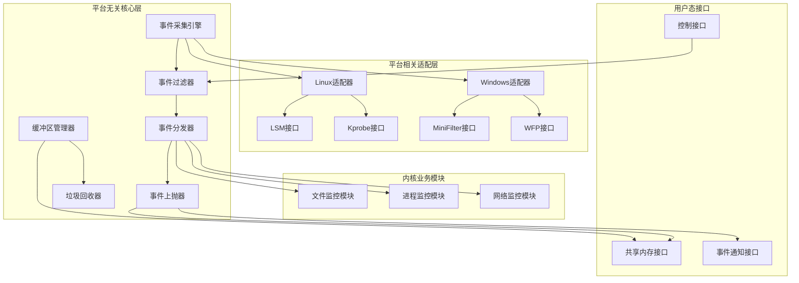
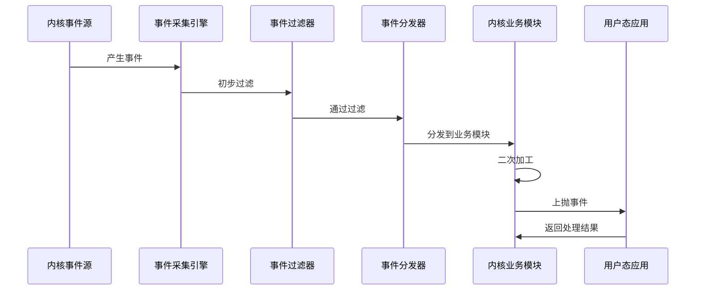
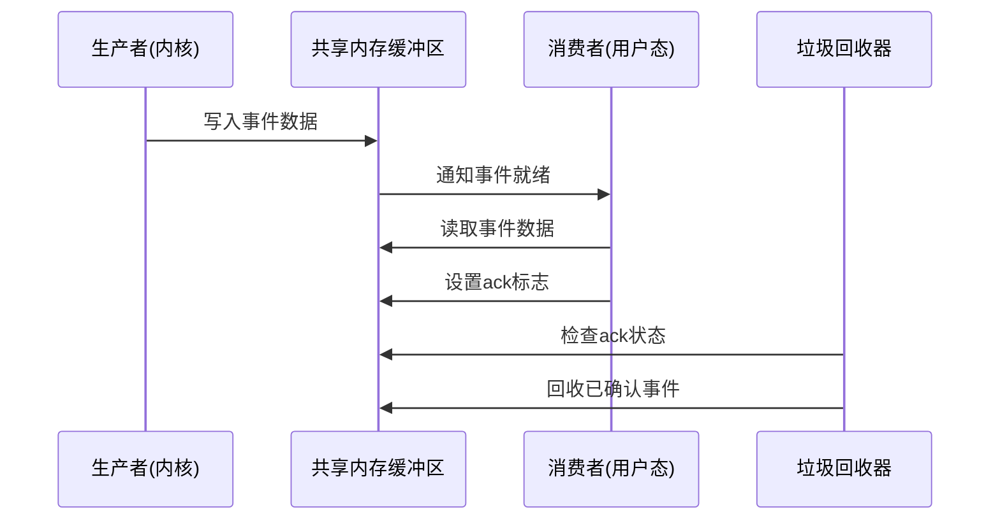
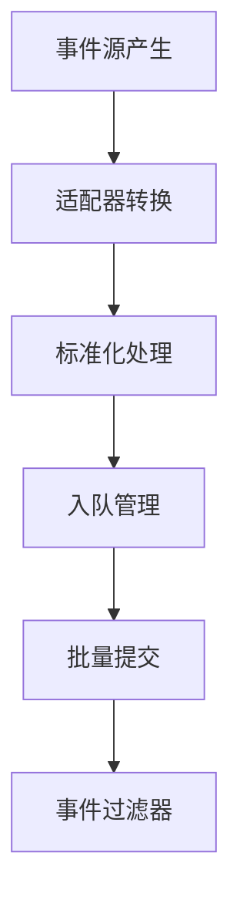
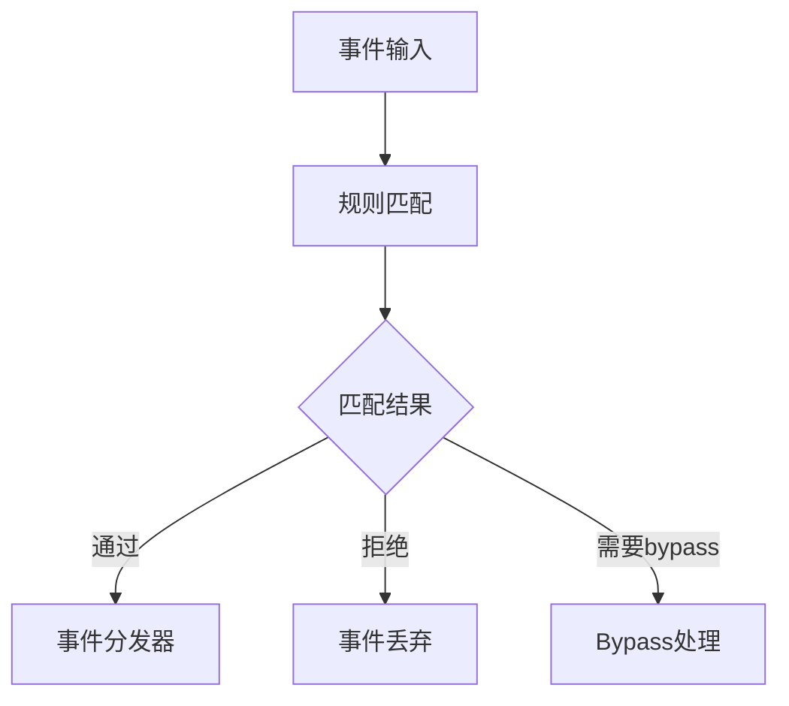
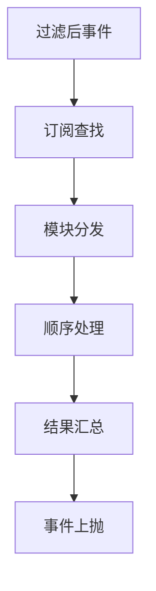

# 跨平台内核事件采集方案概要设计

## 1. 介绍

### 1.1. 目的
本设计旨在构建一个高性能、跨平台的内核级事件采集系统，支持Linux和Windows平台，实现文件、进程、网络等内核事件的实时采集、过滤、分发和上抛。本模块承担内核事件采集的核心职责，为上层安全分析、审计监控等应用提供可靠的事件数据源。

### 1.2. 定义和缩写
- **LSM**: Linux Security Module，Linux安全模块框架
- **Kprobe**: Linux内核探针机制
- **MiniFilter**: Windows文件系统过滤驱动
- **WFP**: Windows Filtering Platform，Windows过滤平台
- **EventFD**: Linux事件文件描述符
- **RCU**: Read-Copy Update，读-拷贝更新机制
- **GC**: Garbage Collection，垃圾回收
- **ack_bitmap**: 确认位图，用于标记事件处理状态

### 1.3. 参考和引用
- 需求文档：《跨平台内核事件采集方案需求（最终整理版）》
- Linux LSM框架文档
- Windows驱动开发文档
- 内核性能优化最佳实践

## 2. 设计目标

### 2.1 需求
| 编号 | 需求点名称 | 需求点说明/验收条件 | 自检 |
|------|------------|---------------------|------|
| 1 | 跨平台支持 | 支持Linux和Windows平台，平台无关核心代码占70-75%，平台相关适配层占25-30% | 通过，见4.1.1 |
| 2 | 事件采集范围 | 支持文件事件（open/close/read/write/create/delete/rename/chmod）、进程事件（fork/exec/exit/setuid/kill/ptrace）、网络事件（connect/bind/listen/accept/send/recv） | 通过，见4.1.2 |
| 3 | 事件过滤控制 | 支持进程名称、路径前缀、文件后缀、网络端口等过滤条件，支持运行时更新bypass配置 | 通过，见4.1.3 |
| 4 | 事件分发机制 | 支持多个内核业务模块同时订阅同一事件，按顺序分发处理 | 通过，见4.1.4 |
| 5 | 同步异步上抛 | 支持同步上抛（等待应用层阻断决策）和异步上抛（直接写入缓冲区） | 通过，见4.1.5 |
| 6 | 零拷贝传输 | 通过共享内存实现单份数据存储、多进程共享读取，避免数据复制 | 通过，见4.2.1 |
| 7 | 垃圾回收机制 | 基于ack_bitmap的智能回收，支持超时强制回收和两阶段回收 | 通过，见4.2.2 |

### 2.2 模块整体目标
| 编号 | 目标项概述 | 对应的评审标准 | 自检 |
|------|------------|----------------|------|
| 1 | 性能 | 事件采集延迟：微秒级<br>事件吞吐量：10万+事件/秒<br>CPU占用：<5%<br>内存占用：<64MB | 通过 |
| 2 | 资源开销 | 内存占用：<64MB<br>CPU占用：<5%<br>磁盘IO：最小化 | 通过 |
| 3 | 可靠性要求 | 支持进程崩溃自动清理，缓冲区满分级处理，异常情况兜底机制 | 通过 |
| 4 | 兼容性 | 支持Linux 4.x以上内核，Windows 10以上系统<br>接口与协议向前兼容 | 通过 |
| 5 | 可扩展性 | 内核业务模块插件化设计，支持动态订阅事件类型 | 通过 |
| 6 | 安全性 | 防止越权访问，内核模块签名验证，数据完整性保护 | 通过 |

### 2.3 流程要求
| 该文档是否需要外部评审？ | 是 | 按设计流程要求 |
|-------------------------|-----|----------------|
| **审核人签名** | **XXX** | **时间：** |

## 3. 对外接口

### 3.1 API接口
| 名称 | 功能 | 参数 | 返回值 | 备注 |
|------|------|------|--------|------|
| event_subscribe | 订阅事件类型 | event_type, sync_mode, timeout | 订阅ID | 支持同步/异步模式 |
| event_unsubscribe | 取消事件订阅 | subscription_id | 成功/失败 | 自动清理相关资源 |
| get_event_buffer | 获取事件缓冲区 | buffer_id | 缓冲区句柄 | 支持多进程共享 |
| ack_event | 确认事件处理完成 | event_id | 成功/失败 | 原子操作，零拷贝 |

### 3.2 消息接口
| 名称 | 说明 | 字段名 | 类型/长度 | 说明 |
|------|------|--------|------------|------|
| event_header | 事件通用头部 | magic | 32bit | 魔数标识 |
| event_type | 16bit | 事件类型标识 |
| event_size | 32bit | 事件数据长度 |
| timestamp | 64bit | 事件时间戳 |
| event_data | 事件具体数据 | data | 变长 | 事件详细信息 |

## 4. 概要说明

### 4.1 背景描述

#### 4.1.1 工作原理
本模块采用事件驱动架构，通过内核驱动/扩展实时采集系统事件。事件经过初步过滤后，分发给多个内核业务模块进行二次加工，最终通过同步或异步方式上抛给用户态应用。整个流程采用零拷贝设计，通过共享内存实现高效数据传输。

#### 4.1.2 应用场景
- **安全监控场景**：实时监控文件访问、进程创建、网络连接等可疑行为
- **审计日志场景**：记录系统操作历史，满足合规性要求
- **性能分析场景**：分析系统资源使用模式，优化系统性能
- **故障诊断场景**：快速定位系统异常，提高故障恢复效率

#### 4.1.3 对手分析
- **Sysmon (Windows)**：功能全面但性能开销较大，本方案通过零拷贝和智能过滤降低开销
- **Auditd (Linux)**：稳定可靠但扩展性有限，本方案支持插件化业务模块扩展
- **eBPF**：性能优异但学习成本高，本方案提供更友好的开发接口

### 4.2 方案选型

| 评估准则 | 权重 | 评估方法 | 方案1：LSM+Kprobe | 方案2：纯eBPF | 方案3：混合架构 |
|----------|------|----------|-------------------|---------------|-----------------|
| 稳定性 | 40% | 内核版本兼容性测试 | 9 | 7 | 8 |
| 性能 | 30% | 事件采集延迟测试 | 8 | 9 | 8 |
| 开发复杂度 | 20% | 代码量评估 | 7 | 5 | 6 |
| 维护成本 | 10% | 长期维护评估 | 8 | 6 | 7 |

| 备选方案名称 | 本方案的优点 | 本方案的风险和缺点 | 最终选择 |
|-------------|-------------|-------------------|----------|
| 方案1：LSM+Kprobe | 稳定可靠，API成熟，性能开销低 | 功能覆盖可能不完整 | ✓ |
| 方案2：纯eBPF | 性能最优，功能强大 | 学习成本高，兼容性风险 | |
| 方案3：混合架构 | 平衡性能和稳定性 | 架构复杂，调试困难 | |

**最终选择方案1的原因**：基于LSM框架的稳定性优势，结合少量Kprobe补充功能覆盖，在保证性能的同时降低开发和维护风险。

### 4.3 静态结构



### 4.4 对软件总体架构的影响
| 情况分类 | 是否对总设有影响 |
|----------|------------------|
| 1.本次新增或调整的模块对总体架构是否有影响 | 否 |
| 2.本次新增或调整的模块对总体架构有一定程度的影响，但涉及的模块少于3个 | 否 |
| 3.本次新增或调整的模块对总体架构有较大影响，需要对原有软件架构进行较大调整或者重新设计 | 否 |

### 4.5 概要流程

#### 4.5.1 事件采集流程


#### 4.5.2 缓冲区管理流程


#### 4.5.3 可调试性机制分析及设计
- **高并发调试**：提供事件统计接口，实时监控事件处理状态
- **复杂流程调试**：记录事件处理路径，支持事件重放测试
- **性能瓶颈调试**：内置性能分析工具，识别热点路径

#### 4.5.4 可测试性机制分析及设计
- **单元测试**：模块化设计，支持独立测试各组件
- **集成测试**：提供测试框架，支持端到端事件流测试
- **性能测试**：内置压力测试工具，验证性能指标

#### 4.5.5 可扩展可复用设计
- **插件化架构**：内核业务模块支持动态加载
- **事件类型扩展**：支持自定义事件类型定义
- **过滤规则扩展**：支持复杂过滤条件配置

#### 4.5.6 系统隐私设计
- **数据最小化**：只采集必要的系统事件信息
- **用户知情权**：明确告知数据采集目的和范围
- **数据保护**：敏感信息加密存储和传输

#### 4.5.7 安全性设计
- **威胁建模分析**：识别内核模块、数据传输等安全风险
- **安全机制**：驱动签名验证、数据完整性校验、访问控制
- **组件合规性**：开源组件安全扫描，版本漏洞评估

#### 4.5.8 可靠性设计
- **承载载体可靠**：进程故障检测恢复、资源自动清理
- **周边无影响**：资源使用上限控制、性能隔离机制
- **业务流程可靠**：FMEA分析，识别关键失效模式

#### 4.5.9 可维护设计
- **模块化设计**：清晰的模块边界和接口定义
- **配置管理**：支持运行时配置更新
- **日志记录**：详细的运行日志和错误信息

#### 4.5.10 跨平台设计和平台差异处理
- **统一接口**：平台无关的核心接口设计
- **适配层隔离**：平台差异通过函数指针隔离
- **数据结构兼容**：支持32位/64位系统，大小端自适应

### 4.6 方案风险分析
| 风险点 | 风险预研结果/风险规避措施 |
|--------|---------------------------|
| Linux LSM API兼容性风险 | 预研文档《LSM兼容性分析》确认4.x以上内核支持 |
| Windows驱动签名要求 | 使用WHQL认证流程，规避驱动加载失败风险 |
| 性能不达标风险 | 通过原型验证，零拷贝设计可达到性能要求 |
| 内存泄漏风险 | 设计两阶段垃圾回收机制，超时强制回收兜底 |

## 5. 数据结构设计

### 5.1 配置文件定义
| 名称 | 作用 | 默认值 | 取值范围 |
|------|------|--------|----------|
| event_buffer_size | 事件缓冲区大小(MB) | 256 | [64, 2048] |
| max_subscribers | 最大订阅者数量 | 32 | [8, 128] |
| gc_timeout_ms | 垃圾回收超时时间(ms) | 5000 | [1000, 30000] |
| filter_update_interval | 过滤规则更新间隔(s) | 60 | [10, 300] |

### 5.2 全局数据结构定义
| 结构说明 | 事件头部结构，用于标识事件类型和大小 | | |
|----------|--------------------------------------|--|--|
| **结构定义** | **struct event_header {<br>&nbsp;&nbsp;&nbsp;&nbsp;uint32_t magic;<br>&nbsp;&nbsp;&nbsp;&nbsp;uint16_t type;<br>&nbsp;&nbsp;&nbsp;&nbsp;uint32_t size;<br>&nbsp;&nbsp;&nbsp;&nbsp;uint64_t timestamp;<br>&nbsp;&nbsp;&nbsp;&nbsp;uint32_t sequence;<br>};** | | |
| **字段说明** | **字段名** | **取值范围** | **说明** |
| | magic | 0xE5E5E5E5 | 魔数标识，用于数据完整性校验 |
| | type | [0, 65535] | 事件类型标识 |
| | size | [0, 8192] | 事件数据大小，最大8KB |
| | timestamp | 系统时间戳 | 事件发生时间 |
| | sequence | 递增序列号 | 事件顺序标识 |

## 6. 流程设计

### 6.1 事件采集引擎

#### 6.1.1 静态结构
事件采集引擎负责从内核事件源获取原始事件，包括文件系统事件、进程事件、网络事件等。由事件源适配器、事件标准化器、事件队列管理器组成。

#### 6.1.2 处理流程


#### 6.1.3 关键算法描述
- **批量处理算法**：每10ms或累积100个事件触发批量处理，平均延迟5ms，最差场景延迟15ms
- **事件去重算法**：基于时间窗口和事件特征的去重，减少重复事件90%以上

#### 6.1.4 数据结构定义
```c
struct event_item {
    struct event_header header;
    void *data;
    struct list_head list;
    atomic_t ref_count;
};
```

#### 6.1.5 函数列表
| 函数名 | 函数功能 | 参数及返回值 | 说明 |
|--------|----------|--------------|------|
| collect_event | 采集单个事件 | [in]event_source, [out]event_item | 需要持有事件源锁 |
| batch_process | 批量处理事件 | [in]event_list, [out]processed_count | 支持中断处理 |
| normalize_event | 事件标准化 | [in]raw_event, [out]normalized_event | 平台无关转换 |

#### 6.1.6 设计要点检视
| 可维护/可调试措施 | 提供事件统计接口，支持事件重放测试 |
|-------------------|-----------------------------------------------------------|
| **可测试性** | 模块化设计，支持独立单元测试 |
| **自动化测试支持** | 提供测试框架，支持自动化性能测试 |
| **可扩展性** | 支持新事件类型动态注册 |
| **稳定性保证措施** | 异常检测恢复，资源泄漏防护 |
| **工作量估算** | 15人天 |

### 6.2 事件过滤器

#### 6.2.1 静态结构
事件过滤器负责根据配置的规则对事件进行初步过滤，支持进程名称、文件路径、网络端口等过滤条件。由规则管理器、匹配引擎、缓存管理器组成。

#### 6.2.2 处理流程


#### 6.2.3 关键算法描述
- **规则匹配算法**：基于Trie树的快速匹配，支持通配符和正则表达式，平均匹配时间<1μs
- **缓存优化算法**：LRU缓存最近匹配结果，命中率>80%

#### 6.2.4 数据结构定义
```c
struct filter_rule {
    uint32_t rule_id;
    uint16_t event_type;
    char *pattern;
    uint32_t flags;
    struct list_head list;
};
```

#### 6.2.5 函数列表
| 函数名 | 函数功能 | 参数及返回值 | 说明 |
|--------|----------|--------------|------|
| add_filter_rule | 添加过滤规则 | [in]rule, [out]rule_id | 支持动态更新 |
| match_event | 事件规则匹配 | [in]event, [in]rules, [out]match_result | 线程安全 |
| update_bypass | 更新bypass配置 | [in]event_type, [in]bypass_state | 实时生效 |

#### 6.2.6 设计要点检视
| 可维护/可调试措施 | 规则匹配日志，性能统计接口 |
|-------------------|-----------------------------------|
| **可测试性** | 支持规则测试工具，覆盖率统计 |
| **自动化测试支持** | 自动化规则验证，性能基准测试 |
| **可扩展性** | 支持自定义匹配算法插件 |
| **稳定性保证措施** | 规则语法验证，异常规则防护 |
| **工作量估算** | 12人天 |

### 6.3 事件分发器

#### 6.3.1 静态结构
事件分发器负责将过滤后的事件分发给多个内核业务模块，支持模块动态订阅和取消订阅。由订阅管理器、分发队列、负载均衡器组成。

#### 6.3.2 处理流程


#### 6.3.3 关键算法描述
- **负载均衡算法**：基于模块处理能力的动态负载分配，支持模块热插拔
- **事件排序算法**：保证同一事件类型按订阅顺序处理，避免竞态条件

#### 6.3.4 数据结构定义
```c
struct subscriber {
    uint32_t sub_id;
    uint16_t event_types;
    void *callback;
    struct list_head list;
};
```

#### 6.3.5 函数列表
| 函数名 | 函数功能 | 参数及返回值 | 说明 |
|--------|----------|--------------|------|
| subscribe_event | 订阅事件类型 | [in]event_types, [in]callback, [out]sub_id | 支持批量订阅 |
| unsubscribe_event | 取消事件订阅 | [in]sub_id | 自动清理资源 |
| dispatch_event | 分发事件 | [in]event, [in]subscribers | 顺序分发保证 |

#### 6.3.6 设计要点检视
| 可维护/可调试措施 | 订阅状态监控，分发性能统计 |
|-------------------|-----------------------------------|
| **可测试性** | 支持模拟订阅者，分发测试工具 |
| **自动化测试支持** | 自动化订阅测试，性能压力测试 |
| **可扩展性** | 支持新分发策略插件 |
| **稳定性保证措施** | 订阅者异常保护，资源泄漏防护 |
| **工作量估算** | 10人天 |

## 7. 完成设计checklist自检

| 检查项 | 状态 | 说明 |
|--------|------|------|
| 需求覆盖完整性 | ✓ | 覆盖所有核心需求点 |
| 架构设计合理性 | ✓ | 分层架构，模块化设计 |
| 性能指标明确性 | ✓ | 明确的性能目标和验证方法 |
| 风险分析充分性 | ✓ | 识别主要风险并提供解决方案 |
| 接口定义完整性 | ✓ | 完整的API和消息接口定义 |
| 数据结构设计 | ✓ | 清晰的数据结构定义和关系 |
| 流程设计完整性 | ✓ | 完整的业务流程和异常处理 |
| 可测试性设计 | ✓ | 充分的测试支持机制 |
| 可维护性设计 | ✓ | 模块化、可扩展的设计 |
| 安全性设计 | ✓ | 威胁建模和安全机制设计 |

## 8. 总结

### 8.1 关联分析
本设计为新增模块，不影响现有系统架构。与系统监控、安全审计等模块存在协作关系，通过标准化接口进行数据交换。

### 8.2 遗留问题解决
- **热升级支持**：当前版本不支持热升级，在架构设计上预留了双副本机制
- **复杂过滤规则**：当前支持基础过滤，复杂规则支持在后续版本中扩展

## 9. 业务逻辑相关的测试用例

### 9.1 事件采集测试
- **测试步骤**：模拟文件操作、进程创建、网络连接等事件
- **验证点**：事件采集完整性、时间戳准确性、性能指标达标

### 9.2 过滤规则测试
- **测试步骤**：配置不同过滤规则，验证过滤效果
- **验证点**：规则匹配准确性、性能影响、动态更新功能

### 9.3 事件分发测试
- **测试步骤**：多个模块订阅同一事件类型
- **验证点**：分发顺序正确性、负载均衡效果、异常处理

### 9.4 上抛机制测试
- **测试步骤**：测试同步和异步上抛场景
- **验证点**：超时处理、缓冲区管理、数据完整性

## 10. 变更控制

### 10.1 变更列表
| 变更章节 | 变更内容 | 变更原因 | 变更对老功能、原有设计的影响 |
|----------|----------|----------|------------------------------|
| 无 | 无 | 无 | 无 |

---

**文档版本**: V1.0  
**创建日期**: 2024年12月  
**最后更新**: 2024年12月  
**文档状态**: 待评审
